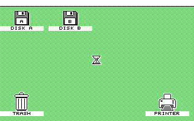

# GoST - Atari ST Emulator in Go

<p align="center">
  
</p>

GoST is an Atari ST emulator in Go built around [`github.com/jenska/m68kemu`](https://github.com/jenska/m68kemu) for Motorola 68000 CPU emulation.

Browser build target after GitHub Pages is enabled: [GoST WebAssembly demo](https://jenska.github.io/gost/)

## Status

Major milestone:

- `v0.2.0` is the first GoST release that boots the bundled EmuTOS image all the way to the GEM desktop.

GoST has moved beyond early bring-up and now provides a usable Atari ST desktop baseline:

- The bundled EmuTOS image boots to the GEM desktop in both monochrome and color-monitor modes.
- The desktop frontend runs in an Ebitengine window with working keyboard, mouse, and audio paths.
- Headless execution, PNG frame dumping, CPU/boot tracing, and browser builds are available for development and debugging.
- The machine model now includes RAM, ROM, Shifter, Blitter, MFP, IKBD/ACIA, floppy DMA/FDC, and YM2149-backed PSG audio.

This is still not a complete Atari ST emulator for broad real-software compatibility yet. The current focus is cleanup, stabilization, and expanding compatibility from the working desktop baseline.

Latest 400-frame color desktop boot:



Current focus:

- Stabilize longer interactive GEM desktop sessions.
- Improve compatibility with more real Atari ST applications and disk images.
- Continue filling hardware behavior gaps where real software exposes them.

## Features

- Motorola 68000 emulation via [`github.com/jenska/m68kemu`](https://github.com/jenska/m68kemu)
- Atari ST machine model with a 24-bit bus, ROM overlay boot, and 1 MiB RAM default profile
- GEM desktop boot with the bundled EmuTOS ROM
- Monochrome and color-monitor boot modes
- Low, medium, and high resolution Shifter framebuffer rendering
- Working desktop input path for keyboard and mouse through IKBD/ACIA
- YM2149-backed PSG sound with live audio playback in the desktop frontend
- Atari ST Blitter register model exercised by live GEM/VDI boot
- MFP timer and interrupt delivery
- Floppy DMA/FDC path with `.st` and `.msa` image support
- Desktop frontend via Ebitengine
- Headless execution with PNG framebuffer dumping
- CPU, boot, and verbose tracing for bring-up and debugging
- WebAssembly build target for browser-based experiments
- Automated Go test coverage for devices, emulator behavior, and frontend integration

## Project Layout

```text
cmd/gost                CLI entrypoint
internal/emulator       Machine orchestration, config, and ST bus wiring
internal/devices        Atari ST hardware device models
internal/platform       Host frontend integrations
```

## Requirements

- Go 1.26+

The repository includes a bundled default ROM:

- EmuTOS 1.4 US 256K image
- Source: [official EmuTOS 1.4 release](https://sourceforge.net/projects/emutos/files/emutos/1.4/)
- Upstream license and release readme are mirrored in `internal/assets/EMUTOS-LICENSE.txt` and `internal/assets/EMUTOS-README.txt`

## Running

Desktop mode:

```bash
make run
```

```bash
go run ./cmd/gost
```

If `downloads/atari-st/PDATS321.msa` exists locally, `make run` and `make headless` automatically mount it as drive A.

Color monitor mode:

```bash
go run ./cmd/gost --color-monitor
```

Headless mode:

```bash
make headless
```

```bash
go run ./cmd/gost --headless --frames 300
```

Headless color desktop boot:

```bash
go run ./cmd/gost --headless --color-monitor --frames 400 --dump-frame /tmp/gost-color-desktop.png
```

Headless boot inspection with a PNG dump:

```bash
go run ./cmd/gost --headless --frames 60 --trace boot --dump-frame /tmp/gost-boot.png
```

Verbose headless boot inspection:

```bash
go run ./cmd/gost --headless --frames 20 --trace boot-verbose
```

Late-boot trace inspection in a custom PC range:

```bash
go run ./cmd/gost --headless --frames 20 --trace boot-verbose --trace-start 0xE16780 --trace-end 0xE16820
```

With a floppy image:

```bash
make run ARGS="--floppy-a /path/to/disk.msa"
```

```bash
go run ./cmd/gost --floppy-a /path/to/disk.msa
```

Override the bundled OS:

```bash
make run ARGS="--os /path/to/tos.rom"
```

```bash
go run ./cmd/gost --os /path/to/tos.rom
```

## WebAssembly

Yes: this project already compiles to `GOOS=js GOARCH=wasm`, and the bundled EmuTOS image makes a browser build practical without adding ROM download steps.

Build the browser demo assets into `docs/`:

```bash
make wasm
```

Serve the generated files locally:

```bash
python3 -m http.server --directory docs 8000
```

Then open [http://localhost:8000](http://localhost:8000).

The repository also includes a GitHub Pages workflow at [`./.github/workflows/pages.yml`](./.github/workflows/pages.yml). Once Pages is enabled for GitHub Actions on this repository, the README link above points to the expected public URL:

- [https://jenska.github.io/gost/](https://jenska.github.io/gost/)

Current browser-build limitations:

- The browser build always boots the bundled EmuTOS image.
- CLI paths such as `--rom`, `--os`, `--floppy-a`, and `--dump-frame` remain desktop/headless features unless a browser-side file picker is added later.
- The generated `.wasm` binary must be served over HTTP; opening `docs/index.html` directly from disk will not work.

### CLI Flags

- `--rom <path>`: path to the TOS ROM image
- `--os <path>`: alias for `--rom`
- `--floppy-a <path>`: optional floppy disk image for drive A (`.st` or `.msa`)
- `--scale <n>`: window scale factor, default `2`
- `--fullscreen`: start fullscreen
- `--headless`: run without opening a window
- `--color-monitor`: emulate an Atari color monitor instead of monochrome
- `--frames <n>`: number of frames to run in headless mode, default `300`
- `--trace <mode>`: enable tracing, currently `cpu`, `cpu-verbose`, `boot`, or `boot-verbose`
- `--trace-start <addr>`: first PC included in `boot` and `boot-verbose` traces, default `0xE00000`
- `--trace-end <addr>`: last PC included in `boot` and `boot-verbose` traces, default `0xE01000`
- `--dump-frame <path>`: write the last rendered framebuffer to a PNG file

## Development

Run tests:

```bash
make test
```

```bash
go test ./...
```

Debug-oriented emulator probes are kept behind a build tag so the default suite stays fast:

```bash
go test -tags debugtests ./internal/emulator
```

Build everything:

```bash
make build
```

```bash
go build ./...
```

See available targets:

```bash
make help
```

## Concurrency Notes

At this stage, the emulator core is intentionally single-threaded. The CPU, bus, memory map, device advancement, and interrupt dispatch currently run in a deterministic lockstep loop. That makes bring-up, debugging, and test behavior much easier to reason about while the hardware models are still incomplete.

Using goroutines "wherever possible" is not recommended yet. For an emulator, broad early concurrency tends to introduce races, lock contention, and timing bugs before correctness is established. The current priority is accurate and predictable behavior rather than parallel execution.

### Recommended Near-Term Approach

- Keep the emulation core single-threaded.
- Prefer goroutines only at host-side boundaries such as async file loading, trace/log streaming, debugger tooling, or future audio buffering.
- If concurrency is introduced in the machine layer, prefer a single emulation goroutine that owns all `Machine` state and accepts input/events through channels.

### Shifter Guidance

The shifter is a possible future concurrency boundary, but not in its current form. Today it renders directly from live RAM and live register state, so moving rendering to another goroutine would require synchronization around RAM, palette registers, resolution, base address, and framebuffer ownership.

If shifter work is parallelized later, the safer design is:

- Keep emulation-side shifter state single-threaded.
- At frame boundaries, capture an immutable snapshot of the visible video state.
- Include the screen base, resolution, palette, and the RAM bytes needed for the visible frame.
- Hand that snapshot to a renderer goroutine that converts bitplanes into an RGBA back buffer.
- Present the completed back buffer on a later host frame.

This preserves deterministic emulation while creating room for asynchronous framebuffer conversion and double-buffering.

## Current Implementation Notes

- The CPU core is provided by `m68kemu`; this repo does not implement its own 68000.
- If no ROM path is passed, `cmd/gost` boots the bundled EmuTOS image by default.
- The machine runs with an 8 MHz default clock and 50 Hz frame cadence.
- The video path renders from RAM-backed bitplanes into an RGBA framebuffer for the host frontend.
- Interrupts are routed into the CPU through the machine layer.
- The floppy controller is intentionally simplified and currently models sector reads rather than full WD1772 behavior.

## Known Gaps

- Real TOS boot coverage beyond the bundled EmuTOS image is not complete yet
- MMU/GLUE behavior is still incomplete
- Shifter timing and register coverage are partial
- MFP support is minimal and only suitable for early bring-up
- IKBD protocol coverage is incomplete
- Audio generation is not implemented yet
- No STE features, blitter, hard disk, MIDI, or copy-protected disk format support yet

## Next Steps

- Improve MMU/GLUE/Shifter behavior for broader TOS compatibility
- Expand MFP coverage and timing accuracy
- Flesh out IKBD and ACIA behavior to match TOS expectations
- Deepen WD1772 emulation beyond simple sector access
- Add real YM2149 audio output
- Build debugger and trace tooling around the existing machine core
