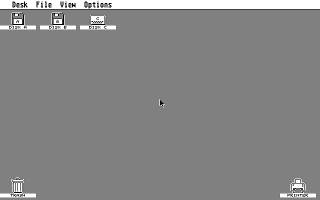

# GoST - Atari ST Emulator in Go

<p align="center">
  
</p>

GoST is an Atari ST emulator in Go built around [`github.com/jenska/m68kemu`](https://github.com/jenska/m68kemu) for Motorola 68000 CPU emulation.

Browser build target: [GoST WebAssembly demo](https://jenska.github.io/gost/)

Latest release notes: [v0.3.0](CHANGELOG.md#v030---2026-06-13)

## Status

Major milestone:

GoST has moved beyond early bring-up and now provides a usable Atari ST desktop baseline:

- The bundled EmuTOS image boots to the GEM desktop in both monochrome and color-monitor modes.
- The desktop frontend runs in an Ebitengine window with working keyboard, mouse, and audio paths.
- Headless execution, asynchronous PNG frame dumping, CPU/boot tracing, and browser builds are available for development and debugging.
- The machine model now includes RAM, ROM, Shifter, Blitter, MFP, IKBD/ACIA, MIDI/RS232 byte I/O, floppy DMA/FDC, YM2149-backed PSG audio, and basic STE DMA sound.

This is still not a complete Atari ST emulator for broad real-software compatibility yet. The current focus is cleanup, stabilization, and expanding compatibility from the working desktop baseline.

Latest 1000-frame desktop boot:



Current focus:

- Stabilize longer interactive GEM desktop sessions.
- Improve compatibility with more real Atari ST applications and disk images.
- Continue filling hardware behavior gaps where real software exposes them.

Known working software includes 1st Word Plus 2.02 from Atarimania `.stx` floppy images on the 1040STE monochrome profile.

## Features

- Motorola 68000 emulation via [`github.com/jenska/m68kemu`](https://github.com/jenska/m68kemu)
- Atari ST machine model with a 24-bit bus, ROM overlay boot, and 1 MiB RAM default profile
- GEM desktop boot with the bundled EmuTOS ROM
- Monochrome and color-monitor boot modes
- Low, medium, and high resolution Shifter framebuffer rendering
- Working desktop input path for keyboard and mouse through IKBD/ACIA
- YM2149-backed PSG sound with live audio playback in the desktop frontend
- Basic STE DMA sound playback in STE model mode
- Atari ST Blitter register model exercised by live GEM/VDI boot
- MFP timer delivery plus GLUE-backed VBL/HBL autovector timing
- Basic MIDI and RS232 byte I/O paths for ACIA/MFP register-level testing
- Optional read-only cartridge ROM mapping at `$FA0000-$FBFFFF`
- Floppy DMA/FDC path with `.st`, `.msa`, `.stx`, `.dim`, and compatible headered `.adi` image support
- Virtual ACSI hard disk (30 MiB default) that enumerates as C: under bundled EmuTOS
- Optional ICD-compatible ACSI real-time clock
- Desktop frontend via Ebitengine
- Headless execution with PNG framebuffer dumping
- Host-side PNG frame/screenshot encoding can run on worker goroutines from immutable framebuffer snapshots
- CPU, boot, and verbose tracing for bring-up and debugging
- WebAssembly build target for browser-based experiments
- Automated Go test coverage for devices, emulator behavior, and frontend integration

## Project Layout

```text
cmd/gost                CLI entrypoint
internal/config         Presets, JSON config loading, and CLI flag parsing
internal/emulator       Machine orchestration and ST bus wiring
internal/devices        Atari ST hardware device models
internal/platform       Host frontend integrations
```

## Requirements

- Go 1.26+

The repository includes a bundled default ROM:

- EmuTOS 1.4 US 256K image
- Source: [official EmuTOS 1.4 release](https://sourceforge.net/projects/emutos/files/emutos/1.4/)
- Upstream license and release readme are mirrored in `internal/assets/EMUTOS-LICENSE.txt` and `internal/assets/EMUTOS-README.txt`

## Running

Start the emulator with the bundled EmuTOS image:

```bash
make run
```

```bash
go run ./cmd/gost
```

The repository ignores `TOS/`, so personal ROM images can be kept there for local testing without adding them to Git. The Makefile also provides convenience targets such as `make headless`, `make run-rom`, `make headless-rom`, `make run-mega-tos102`, `make test`, `make build`, and `make help`.

CLI flags can be passed through `ARGS` when using Make targets, or directly after `go run ./cmd/gost`.

JSON config files are also supported. Config keys use the same names as CLI flags without the leading `--`:

```json
{
  "preset": "mega-st",
  "floppy-a": "/path/to/disk-a.msa",
  "floppy-b": "/path/to/disk-b.msa",
  "hd-size-mb": 30,
  "rtc": true,
  "cpu-mhz": 8,
  "cpu-clock-hz": 8000000,
  "color-monitor": false,
  "trace-start": "0xE00000",
  "trace-end": "0xE01000"
}
```

Load order is: preset defaults, then JSON config file, then CLI flags.

Ready-to-use machine profiles are available in `configs/`:

- `configs/atari-1040stf-color.json`
- `configs/atari-1040stf-mono.json`
- `configs/atari-1040ste-color.json`
- `configs/atari-1040ste-mono.json`

Use them with `--config`, for example:

```bash
go run ./cmd/gost --config configs/atari-1040ste-color.json
```

### CLI Flags

- `--config <path>`: optional JSON config file loaded before CLI overrides
- `--preset <name>`: machine preset, currently `default`, `stf`, `st`, or `mega-st`
- `--model <name>`: hardware model, currently `st` or `ste`
- `--rom <path>`: path to the TOS ROM image; bundled EmuTOS is used when omitted
- `--cartridge <path>`: optional cartridge ROM image mapped read-only at `$FA0000-$FBFFFF` (up to 128 KiB)
- `--floppy-a <path>`: optional floppy disk image for drive A (`.st`, `.msa`, `.stx`, `.dim`, or compatible headered `.adi`)
- `--floppy-b <path>`: optional floppy disk image for drive B (`.st`, `.msa`, `.stx`, `.dim`, or compatible headered `.adi`)
- `--hd-size-mb <n>`: virtual ACSI hard disk size in MiB (default `30`, set `0` to disable)
- `--hd-image <path>`: optional persistent ACSI hard disk image file; raw sector images and `.hdi` containers are supported
- `--rtc`: enable the optional ICD-compatible ACSI real-time clock
- `--ram-size <bytes>`: emulated RAM size in bytes
- `--clock-hz <n>`: base machine clock frequency in Hz
- `--cpu-mhz <n>`: CPU frequency in MHz; changes CPU speed without changing other hardware timing
- `--cpu-clock-hz <n>`: CPU frequency in Hz; equivalent to `--cpu-mhz` but avoids decimal conversion
- `--frame-hz <n>`: display and VBL refresh rate in Hz; frame timing is derived from `clock-hz / frame-hz`
- `--color-monitor`: emulate an Atari color monitor instead of monochrome
- `--midres-y-scale <n>`: scale medium-resolution display height on host output (`1` = off)
- `--scale <n>`: window scale factor
- `--fullscreen`: start fullscreen
- `--headless`: run without opening a window
- `--frames <n>`: number of frames to run in headless mode
- `--trace <mode>`: enable tracing, currently `cpu`, `cpu-verbose`, `boot`, `boot-verbose`, `shifter`, or `shifter-verbose`
- `--trace-start <addr>`: first PC included in `boot` and `boot-verbose` traces
- `--trace-end <addr>`: last PC included in `boot` and `boot-verbose` traces
- `--dump-frame <path>`: write the last rendered framebuffer to a PNG file; encoding uses the same snapshot-safe frame dump path that can queue multiple PNG jobs in parallel from host-side tooling

## WebAssembly

Yes: this project already compiles to `GOOS=js GOARCH=wasm`, and the bundled EmuTOS image makes a browser build practical without adding ROM download steps.

Build the browser demo assets into `wasm/`:

```bash
make wasm
```

Serve the generated files locally:

```bash
python3 -m http.server --directory wasm 8000
```

Then open [http://localhost:8000](http://localhost:8000).

The repository also includes a GitHub Pages workflow at [`./.github/workflows/pages.yml`](./.github/workflows/pages.yml).

Current browser-build limitations:

- The browser build always boots the bundled EmuTOS image.
- CLI paths such as `--rom`, `--floppy-a`, `--floppy-b`, `--hd-size-mb`, `--hd-image`, and `--dump-frame` remain desktop/headless features unless a browser-side file picker is added later.
- The generated `.wasm` binary must be served over HTTP; opening `wasm/index.html` directly from disk will not work.

## Development

Run tests:

```bash
make test
```

```bash
go test ./...
```

Debug-oriented emulator probes are kept behind a build tag so the default suite stays fast:

```bash
go test -tags debugtests ./internal/emulator
```

Build everything:

```bash
make build
```

```bash
go build ./...
```

See available targets:

```bash
make help
```

## Concurrency Notes

At this stage, the emulator core is intentionally single-threaded. The CPU, bus, memory map, device advancement, and interrupt dispatch currently run in a deterministic lockstep loop. That makes bring-up, debugging, and test behavior much easier to reason about while the hardware models are still incomplete.

Using goroutines "wherever possible" is not recommended in the emulation core. For an emulator, broad concurrency tends to introduce races, lock contention, and timing bugs before correctness is established. Current concurrency is kept at phase boundaries and host-side pipelines where immutable snapshots or queues make ownership explicit.

### Recommended Near-Term Approach

- Keep the emulation core single-threaded.
- Prefer goroutines only at host-side boundaries such as async file loading, trace/log streaming, debugger tooling, audio buffering, or frame/screenshot/video export.
- If concurrency is introduced in the machine layer, prefer a single emulation goroutine that owns all `Machine` state and accepts input/events through channels.

### Host-Side Export Guidance

Frame dumping and screenshot-style export are safe concurrency boundaries after a frame has completed. The emulator captures an RGBA framebuffer snapshot, then worker goroutines can encode PNG output without touching live RAM, shifter registers, or the active framebuffer. The same model should be used for future video encoding: queue immutable frame snapshots to an encoder pipeline and keep all codec work outside the emulation step.

### Shifter Guidance

The shifter render path now parallelizes scanline conversion within the frame boundary while keeping emulation-side state single-threaded. Register/RAM sampling remains deterministic; worker goroutines operate on prepared line state and write disjoint framebuffer ranges. Host export still uses copied framebuffer snapshots rather than the live back buffer.

## Current Implementation Notes

- The CPU core is provided by `m68kemu`; this repo does not implement its own 68000.
- If no ROM path is passed, `cmd/gost` boots the bundled EmuTOS image by default.
- The machine runs with an 8 MHz default clock and 50 Hz frame cadence.
- The video path renders from RAM-backed bitplanes into an RGBA framebuffer for the host frontend, with host-side PNG export queued from immutable framebuffer snapshots.
- Interrupts are routed into the CPU through the machine layer.
- The floppy controller now covers WD1772 command groups (type I/II/III/IV) over sector images, including seek/step commands, sector and track DMA reads/writes, and read-address support.
- Pasti `.stx` files are decoded into GoST's current sector-image model when they contain normal 512-byte sectors. STX-specific protection metadata such as fuzzy bits, timing records, duplicate sector IDs, non-512-byte sectors, and exact track-image behavior is not fully emulated yet.
- 1st Word Plus 2.02 has been verified from Atarimania `.stx` disk images with drive A/B mounted under the 1040STE monochrome profile.
- A virtual ACSI hard disk is attached by default with 30 MiB capacity.
- Use `--hd-image` to persist hard-disk contents across emulator restarts; `.hdi` files are stored with an Anex86-compatible header.
- Use `--rtc` to attach the ICD-compatible ACSI real-time clock backed by the host system clock.

## Known Gaps

- Real TOS boot coverage beyond the bundled EmuTOS image is not complete yet
- MMU behavior and cycle-exact GLUE/shifter timing are still incomplete
- Shifter timing and register coverage are partial
- IKBD protocol coverage is incomplete
- Host MIDI backend/timing and copy-protected disk format support are still missing

## Next Steps

- Improve MMU and cycle-exact shifter/GLUE behavior for broader TOS compatibility
- Expand MFP coverage and timing accuracy
- Flesh out IKBD and ACIA behavior to match TOS expectations
- Improve ACSI hard-disk command coverage and real-software compatibility
- Build debugger and trace tooling around the existing machine core
